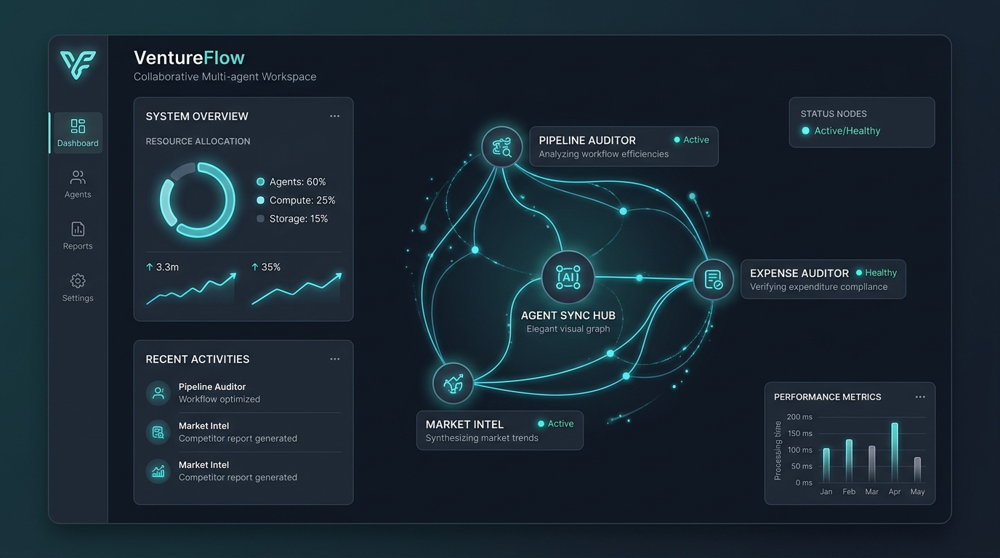

# 🌊 VentureFlow: Collaborative Agent Workspace



VentureFlow is a highly polished, interactive, full-stack multi-agent audit and strategic reasoning platform. It simulates and visualizes a workspace where specialized AI agents collaborate in real-time to analyze corporate sales pipelines, audit ledger expenses, and perform search-grounded market competitor scans.

---

## 🚀 Key Features

- **📊 Pipeline Velocity & Audit Agent**: Analyzes stage-to-stage conversion bottlenecks, contract stagnation thresholds, and optimizes team velocity.
- **🛡️ Expense & Ledger Audit Agent**: Inspects ledger card raw feeds to identify SaaS redundancies, double-billing, and policy variations.
- **🔍 Market Competitor Intel Agent**: Uses live search grounding to map competitor ecosystems, target markets, TAM (Total Addressable Market), and regulatory barriers.
- **⚡ Real-Time Visualization**: Implements beautiful, custom interactive logs, trace feeds, status updates, and dynamic charts to represent the collaboration.
- **🛡️ Hardened Security**: All Gemini AI invocations are proxied through a secure backend layer so that API keys are never exposed to the client-side browser.

---

## 🏗️ Architecture & Deployment Setup

VentureFlow is fully optimized to run in two distinct environments:
1. **Local Development / Node Container**: Express server hosting both API endpoints and the static client bundle via a Vite dev-proxy.
2. **Production on Vercel**: Fully configured to execute as high-performance **Vercel Serverless Functions** (`/api` router) for the backend while serving the React SPA on the frontend.

---

## 🛠️ Step-by-Step Guide: How to Run Locally

### 1. Configure Your Local Environment Secrets
Create a `.env` file in the root directory of the project:
```env
# Root /.env file
VENTURE_FLOW="your_gemini_api_key_here"
```
*(Note: The application has been fully programmed to detect both `VENTURE_FLOW` and `GEMINI_API_KEY` seamlessly).*

### 2. Install and Launch
Open your terminal in the project directory:
```bash
# Install required dependencies
npm install

# Run the local full-stack development server
npm run dev
```
Your local application will boot and run on `http://localhost:3000`.

---

## ☁️ Step-by-Step Guide: How to Deploy to Vercel

Vercel deployment is completely streamlined through the pre-packaged `vercel.json` and `/api` serverless handler included in this codebase.

### Step 1: Push Your Code to GitHub
1. Create a new empty repository on [GitHub](https://github.com).
2. Initialize and push your project directory:
   ```bash
   git init
   git add .
   git commit -m "Initial commit of VentureFlow App"
   git branch -M main
   git remote add origin https://github.com/your-username/your-repo-name.git
   git push -u origin main
   ```

### Step 2: Import into Vercel
1. Go to your [Vercel Dashboard](https://vercel.com) and click **Add New** > **Project**.
2. Connect your GitHub account and import your newly created repository.

### Step 3: Configure Environment Variables
Before hitting deploy, expand the **Environment Variables** section and add:
- **Key**: `VENTURE_FLOW`
- **Value**: `Your Gemini API Key` (e.g., `AIzaSy...`)

### Step 4: Deploy!
- Click **Deploy**. Vercel will automatically build the React SPA, compile the `/api` directory into serverless routes, and serve your app live.

---

## 📄 Core Codebase Layout

- `/src` — Frontend React components, custom hook workflows, and Tailwind views.
- `/server` — Backend business logic containing agent instructions and core Gemini model integrations using the latest `@google/genai` SDK.
- `/api` — Serverless entry points configured for Vercel cloud function architecture.
- `/vercel.json` — Edge routing and serverless function path mappings.
- `package.json` — Pre-configured build systems and dependency trees.
